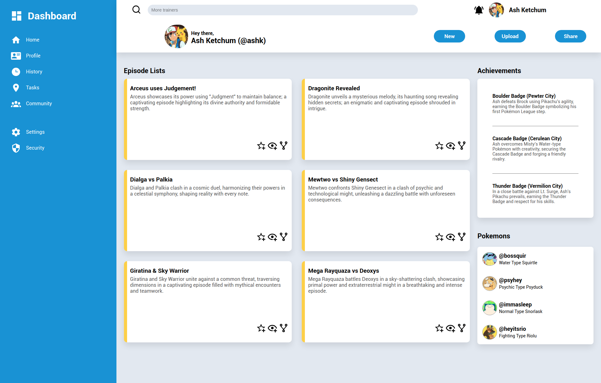

# Pokéboard
a basic admin dashboard (All-Grid Challenge)]

> [Live Website](https://mathdebate09.github.io/pokeboard/)

## Preview

## Languages
 

## Learning Outcomes
- Learnt the complete application of grids case of home-page
- sorted complex grid cascades and created a flexible grid system